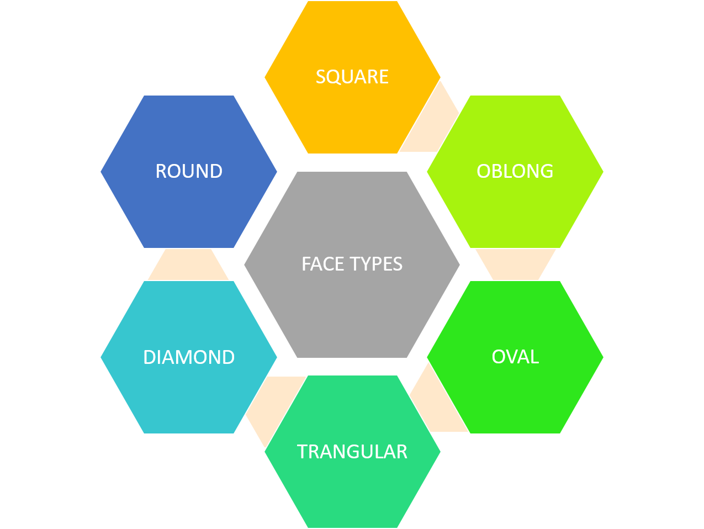
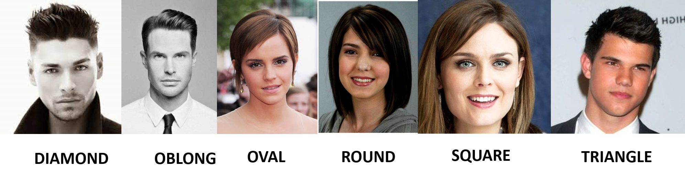
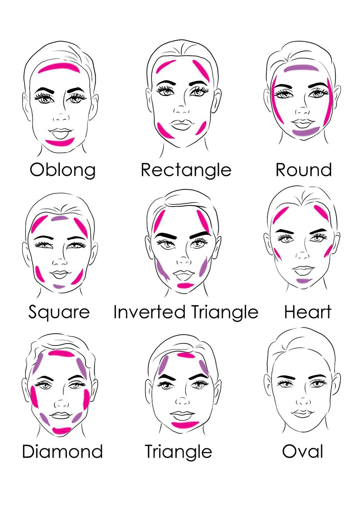
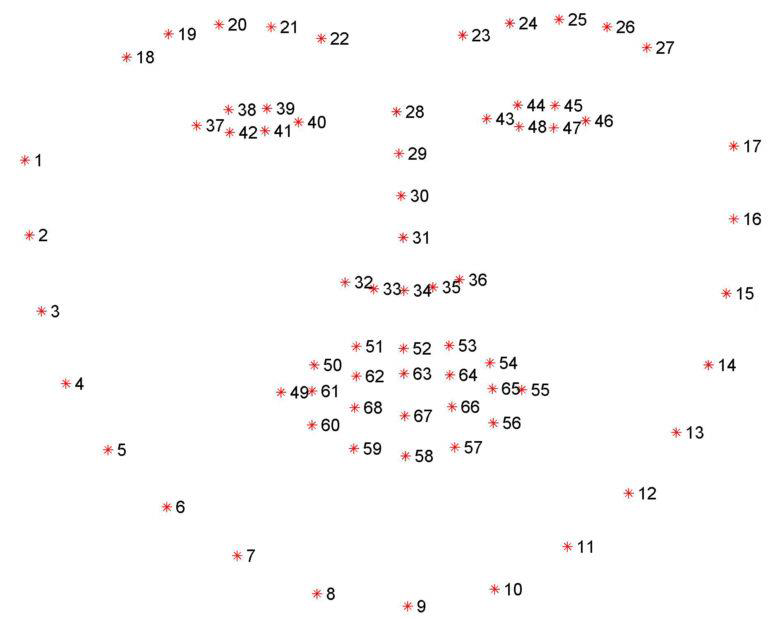

# Week-03-Group4
In Week 3 we develop a Face Type identifying software. This is our first In class Project. For this task we used dlib library together with 68 Face Landmarks detecting algorithm.

## Classification Machine Learning Algorithms Part I - K Nearest Neighbors Classifier

### Problem

Predicting the Face type of a person according to the 6 standard Face Types

### Defining the Labels

**With the problem statement, labels of the Machine Learning problem will be defined**

In this case labels will be defined as 6 standard Face Types

### Defining the Features

**In Machine Learning Feature extraction/ Defining features is done by human.**

for this problem we are going to define features with the 68 Landmarks of face detecting algorithm 

[read more about the algorithm](https://www.pyimagesearch.com/2017/04/03/facial-landmarks-dlib-opencv-python/)

Using the 68 Landmarks (points) the features will be defined,

Every point of the 68 points will contain (x,y) coordinates of the point.

- Let's denote the 68 points as (p1,p2,p3.....,p68)
- Then each and every points has (x,y) coordinates, for example p1[0] will be the x coordinate of the point 1,p1[1] will be the y cooedinate of point 1.

<img src="images/Picture10.png" width="400
<img src="images/Picture9.png" width="400

- As you can see in the Image the, Shape of a human face is almost defined by the p3,p4,p5,p6,p7,p8 and p9 (Assuming the face is almost symmetric)
- Then we can define the features as distances(along x axis) between the p3,p4,p5,p6,p7,p8 and p9 point.
- Then features can be defined as,

d1=p9[0]-p3[0]

d2=p9[0]-p4[0]

d3=p9[0]-p5[0]

d4=p9[0]-p6[0]

d5=p9[0]-p7[0]

d6=p9[0]-p8[0]

- But you will understand that, when the face is closer to the camera these d1,d2,..d6 distances will be increased. And when the face is far from the camera these distance will be decreased. Therefore using d1,d2,..d6 as feature is not effective since they are going to vary with the distance to the face from the camera.

- Therefore we are going to get a ratio, where d2,d3,d4,d5,d6 will be devided by the largest length d1, then the new feature set will be defined as,

D1=d2/d1

D2=d3/d1

D3=d4/d1

D4=d5/d1

D5=d6/d1

This feature set will not be varied with the distance from the camera to the face, therefore we can assume that these faeature are depended only on the face type.

**Now We can apply this problem into a machine learning algorithm as we have defined features and labels**
